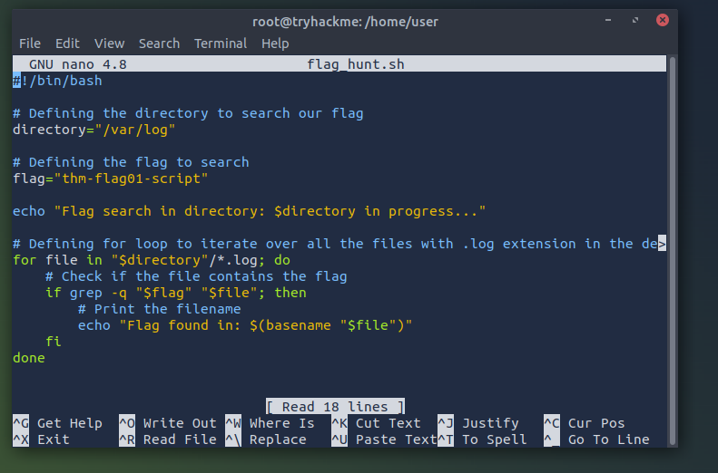
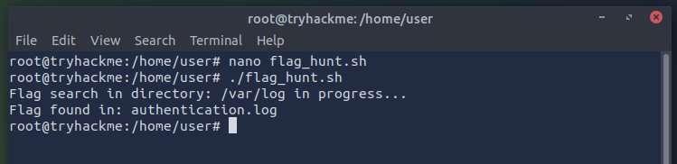

# 🐧 Automação em Linux: Busca de Flags com Shell Script

Este documento registra a criação e execução de um script em Bash desenvolvido para automatizar a busca de padrões (flags) em arquivos de log do sistema.

## 🧠 Conteúdos Aprendidos e Aplicados
A atividade focou no uso do terminal Linux e lógica de programação para segurança:

* **Editor de Texto Nano:** Utilização do editor via terminal para criação e edição do script `flag_hunt.sh`.
* **Estruturas de Repetição (Loops):** Implementação de um laço `for` para percorrer todos os arquivos com extensão `.log` no diretório `/var/log`.
* **Comandos de Busca (grep):** Uso do comando `grep` com a flag `-q` (quiet) para verificar a existência de strings específicas sem poluir a saída do terminal.
* **Variáveis de Ambiente:** Definição de variáveis para diretórios e padrões de busca, facilitando a manutenção do código.

*Figura 1: Desenvolvimento do script flag_hunt.sh utilizando o editor Nano.*

---

## 🛠️ Execução e Resultado

O script foi desenhado para ser eficiente em um cenário de **SOC (Security Operations Center)** ou Forense, onde é necessário encontrar rastros rapidamente em múltiplos arquivos.

### 1. Lógica do Script
O código executa os seguintes passos:
1. Define o diretório alvo: `/var/log`.
2. Define a flag buscada: `thm-flag01-script`.
3. Itera sobre cada arquivo, e caso encontre o padrão, exibe no console o nome do arquivo exato onde a flag está armazenada.

### 2. Validação na Prática
Após dar as permissões de execução, o script foi rodado e identificou com sucesso que a flag estava localizada dentro do arquivo `authentication.log`.

*Figura 2: Execução do script e localização da flag no sistema.*

## 🏁 Conclusão
A automação de tarefas repetitivas no Linux é uma habilidade essencial para qualquer analista de segurança. Este script simples reduz o tempo de busca manual e demonstra o poder das ferramentas nativas do sistema operacional para análise de logs.
