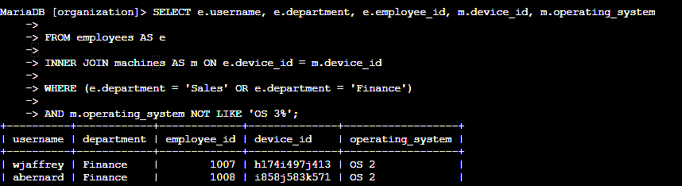
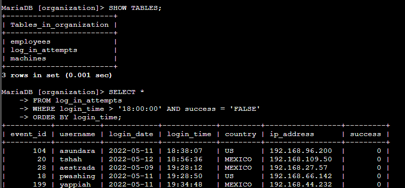
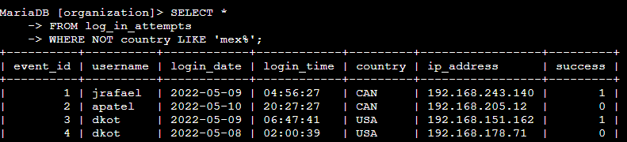

# 🛡️ **RELATÓRIO DE INTELIGÊNCIA DE DADOS: AUDITORIA DE ATIVOS E RESPOSTA A INCIDENTES COM SQL**

**Analista:** Roan Silva dos Anjos 
**Especialidade:** **Segurança de Dados & Análise de Vulnerabilidades** 

---

## 🎯 **OBJETIVO ESTRATÉGICO**

Este projeto demonstra a aplicação de **SQL Avançado** como ferramenta de **defesa cibernética**. O foco foi a extração de inteligência a partir de bancos de dados relacionais para **identificar superfícies de ataque**, investigar **tentativas de acesso não autorizadas** e garantir o ***compliance* de segurança** da infraestrutura. 

Ao cruzar dados de **RH e TI**, transformei dados brutos em **ações preventivas para mitigação de riscos**.

---

## 🔍 **1. IDENTIFICAÇÃO DE MÁQUINAS VULNERÁVEIS (INNER JOIN)**

**Cenário:** Precisamos localizar funcionários de departamentos críticos (**Vendas e Financeiro**) que estão utilizando sistemas operacionais obsoletos (**OS 1 e OS 2**) para priorizar a atualização de segurança.

> 

---

## 🔍 **2. AUDITORIA DE TENTATIVAS DE LOGIN SUSPEITAS**

Investigação focada em **padrões de acesso** que fogem à política de segurança da empresa.

### **A) ACESSOS MALICIOSOS FORA DO HORÁRIO**
Filtro aplicado para detectar tentativas de login que **falharam após as 18:00**, o que pode indicar tentativas de **força bruta**.

### **B) JANELA DE INVESTIGAÇÃO DE INCIDENTE**
Análise de todas as atividades ocorridas no período crítico de **08/05/2022 a 09/05/2022**.

> 

### **C) FILTRAGEM POR ORIGEM GEOGRÁFICA**
Exclusão de tráfego vindo de regiões validadas (**México**) para focar a análise em **IPs externos e desconhecidos**.

> 

---

## 🏗️ **3. GESTÃO DE INVENTÁRIO POR LOCALIZAÇÃO FÍSICA**

**Cenário:** Localização de dispositivos no departamento de **Marketing** situados especificamente no prédio **Leste (East)** para auditoria física.

> 

---

## 🛠️ **HARD SKILLS DEMONSTRADAS**

* **Relacionamento de Dados:** Uso de **INNER JOIN** para vincular ativos a usuários.
* **Lógica Booleana:** Agrupamento de condições com **OR e AND** para filtros de precisão.
* **Análise de Padrões:** Uso de **wildcards (%)** para exclusão e inclusão de strings.
* **Compliance de TI:** Identificação proativa de máquinas fora do **patch de segurança**.
