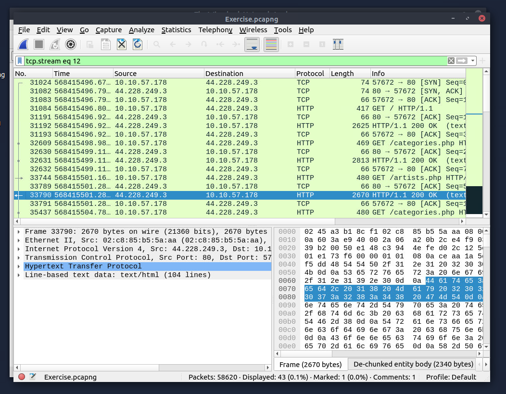

# 🔍 Análise de Tráfego de Rede e Segurança com Wireshark

Este documento detalha a aplicação prática de conceitos de redes e segurança cibernética, utilizando a ferramenta Wireshark para análise de pacotes e identificação de vulnerabilidades.

## 🧠 Conteúdos Técnicos Aplicados
A base teórica foi fundamental para a execução das análises técnicas nas camadas de rede:

* **Networking Concepts:** Estudo do modelo OSI e da suíte de protocolos TCP/IP.
* **Networking Essentials:** Entendimento de rotas e configuração de pacotes para o destino.
* **Networking Core Protocols:** Análise do funcionamento dos protocolos centrais de transporte e rede.
* **Networking Secure Protocols:** Estudo sobre como TLS, SSH e VPN protegem o tráfego de rede.
* **Wireshark Basics:** Domínio da interface e técnicas fundamentais de análise de PCAPs.
---
## 🛠️ Estudo de Caso: Interceptação de Dados via HTTP
O objetivo final da atividade foi localizar e analisar uma conversa específica entre um servidor e um cliente através do protocolo HTTP para encontrar credenciais.
### 1. Isolamento de Fluxo (TCP Stream)
Para focar na comunicação alvo, utilizei o filtro `tcp.stream eq 12`. Isso permitiu visualizar o handshake TCP (SYN, SYN-ACK, ACK) e as requisições GET subsequentes, isolando o tráfego de IPs específicos como `10.10.57.178` e `44.228.249.3`.

*Figura 2: Filtro aplicado para isolar a comunicação entre o servidor e o cliente.*

### 2. Inspeção de Dados em Texto Claro
Ao utilizar o recurso **"Follow HTTP Stream"**, foi possível reconstruir a página HTML e os scripts trafegados. Como o protocolo HTTP não possui criptografia, os dados aparecem em texto claro (plain text). 
Nesta análise, foi possível identificar:
* Estrutura de diretórios e links do site (ex: `artists.php`, `categories.php`).
* O ponto exato onde campos de formulários de login capturam dados sensíveis.
* A vulnerabilidade inerente ao tráfego sem certificados SSL/TLS.

*Figura 3: Reconstrução do tráfego revelando o conteúdo da camada de aplicação.*
## 🏁 Conclusão
A prática demonstrou que a segurança começa na escolha do protocolo. O uso do Wireshark evidenciou que, em uma rede monitorada, qualquer dado enviado via HTTP pode ser facilmente interceptado e lido, reforçando a necessidade crítica do uso de HTTPS para proteção de senhas e usuários.
